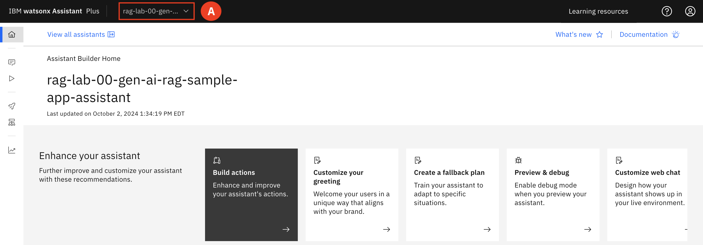
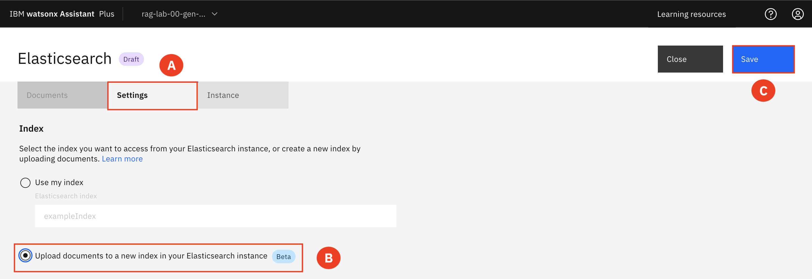
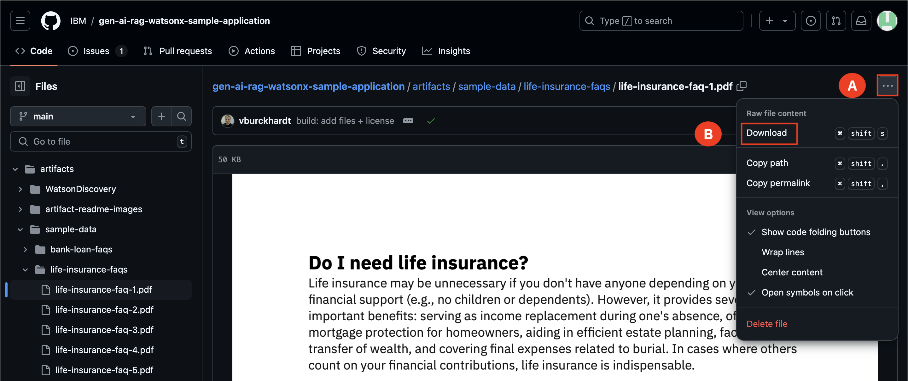

# Upload New Artifacts

1. Expand the **Navigation menu (A)** and filter for **rag-common-services under Group (B)**.   

    Expand the **AI / Machine Learning (C)** section of the resource list.   

    Select the **rag-common-watsonx-assistant-instance (D)**

    

2. Select **Launch Assistant (A)** 

    

3. Check that you are on the correct project that corresponds to your group number. 

    

4. Under **Assistant architecture**, find **Conversational search** and select **Change (A)**

    

5. For the environment select **Draft (A)** and then click **Confirm (B)**

    

6. Select **Elasticsearch (A)**

    

7. On the **Settings tab (A)** select ***Upload documents to a new index in your Elasticsearch index (B)***. Click **Save (C)**.

    

8. Select the **Documents tab (A)** and you should see 5 new files that are related to life insurance.   

    

    

**NOTE:** If you do not see the files, please go to this [link](https://github.com/IBM/gen-ai-rag-watsonx-sample-application/tree/main/artifacts/sample-data/life-insurance-faqs) to download. 

a. Select the file **(A)**
    

b. Select the **triple dot (A)** and then click **Download (B)**.
    

c. Repeat for all files, then go to the download folder on your computer and drag and drop. 

9. You will need to re-launch the chatbot so the changes that have been made to the documents are applied. 

 Ask the questions again regarding life insurance and observe the improvement in answers. 
 
* What are the different life insurance policies?
* When should I buy life insurance? 
* What does life insurance cover
___

Congratulations, you just learned how to integrate new documents into the chatbot, enabling the chatbot to utilize these documents for more accurate and contextually relevant responses.
___

# Optional 

If time permits take a moment to review the resources deployed by the DA you created at the beginning of the lab. All resources with the prefix my-lab were created from your DA. 

1. Expand the **Navigation menu (A)** on the upper right-hand corner. Select **Projects (B)**

    

2. Select the **deployed project(A)** that corresponds to your group number (rag-stack-lab-##, where ## is replaced with your group number).  
For example: rag-stack-lab-00

    

3. Expand MY-lab-## and observe that it has successfully deployed.

    

4. Expand the **Navigation menu (A)** on the upper right-hand corner. Select **Resource list (B)** from the Navigation menu.  
    
    

Filter for your resource group (for example: rag-lab-00-service-rg) and **rag-common-services** under **Group (A)** to view all resources deployed by the DA.   

You may have resources with a starting name of my-lab, these are the resources that are currently being created by the DA you deployed at the beginning of the lab. 
    
